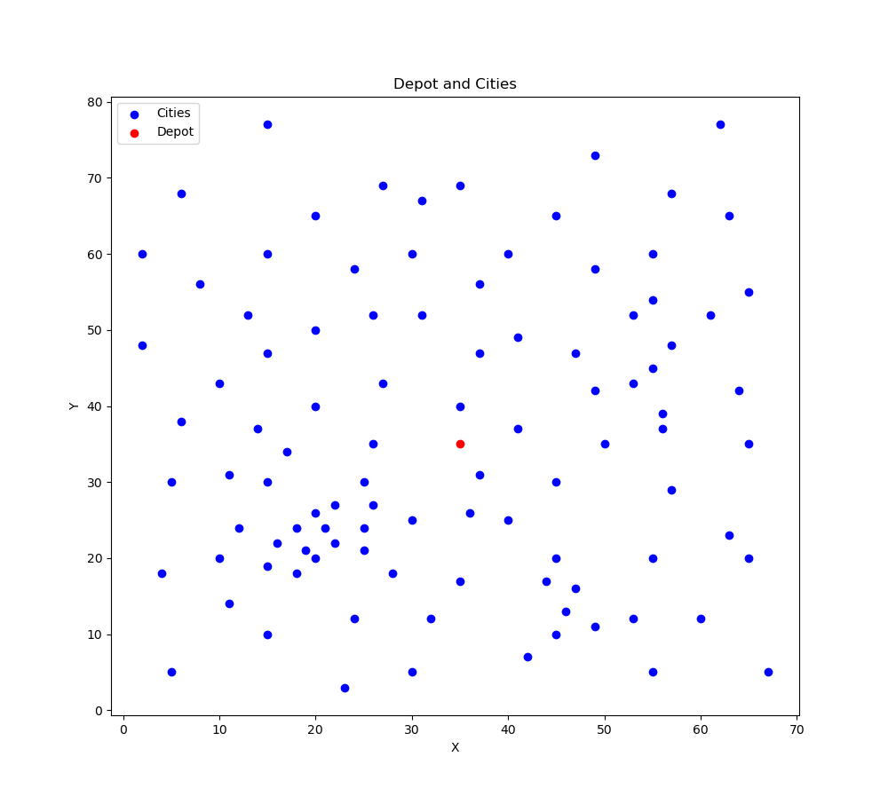
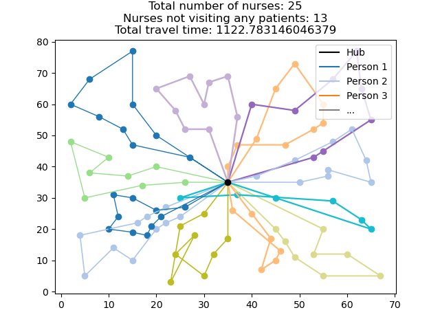
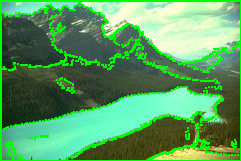

# IT3708 Bio-Inspired AI - Spring 2024 Projects

This repository contains my work for the three projects in the IT3708 Bio-Inspired AI course held at NTNU in the spring of 2024.

## Project 1: Simple Genetic Algorithm

The first project is an introductory exploration of the simple genetic algorithm. We used this algorithm to optimize feature selection for a linear machine learning model. This project is implemented in Python.

## Project 2: Extended Traveling Salesman Problem (TSP)

The second project tackles an NP-hard problem, an extended version of the Traveling Salesman Problem (TSP). The goal is to optimize the route of several home care nurses who are visiting a number of patients. The metric for optimization is the total distance traveled by all nurses. This problem is subject to various constraints, such as each patient must be reached within a given timeframe, each nurse has a maximum capacity, and each nurse must start and end at the same facility within their own timeframe. This project is implemented in Java using the Maven framework.

Here are some visualizations of the problem and its solution:

|  |  |
|:---:|:---:|
| Fig.1 - Problem without routes | Fig.2 - Problem with solution route implemented |

## Project 3: Multi Objective Optimization (MOO) for Image Segmentation

The third project revolves around Multi Objective Optimization (MOO) for image segmentation. Image segmentation is the process of dividing an image into multiple segments to simplify its representation or to analyze it more effectively. This project is also implemented in Java using the Maven framework. The project is divided into two phases:

1. Multi objective optimization using a single target value by weighted sum of objective values.
2. Multi objective optimization using NSGA-II by means of Pareto optimality.

Here are some visualizations of the problem and its solution:

|  |  |
|:---:|:---:|
| Fig.3 - Original image | Fig.4 - Segmented image |
